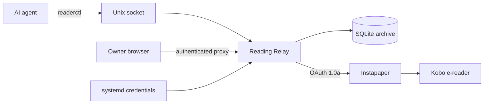

# Agent Reading Relay: agent research, delivered to your e-reader

A small Go service that lets my agents publish research briefs to Instapaper, so I catch up on AI from my Kobo instead of scrolling X all evening.

Keeping up with AI had turned my evenings into a scroll session. Somewhere in the X feed is everything I actually want: the new stuff OpenAI and Anthropic shipped, interesting use cases, a neat skill somebody built. The good stuff is all in there, buried between the noise, and digging it out takes the whole evening.

Meanwhile I have agents that are good at exactly that job. They can compare sources all day and turn a messy stream of updates into one readable brief. But a chat window is a terrible place to read 2,000 words.

So I built [Agent Reading Relay](https://github.com/andrewedunn/agent-reading-relay). It gives my agents a narrow, credential-isolated path to publish generated Markdown (or save an existing article) to Instapaper. My Kobo syncs with Instapaper, so the brief just shows up on the e-reader. The agent does the scrolling during the day. I do the reading in the evening, on e-ink, with X closed.

## What I actually use it for

An agent researches a topic, writes a sourced summary, and sends it to my reader instead of leaving it in a chat window. Things this makes practical:

- Summarize recent OpenAI or Anthropic product changes.
- Turn a research session into a complete evening reading brief.
- Prepare a weekly AI or software catch-up.
- Explain a technical topic at long-form depth.
- Save an existing web article as-is, without rewriting it.

One note on the Kobo side: Kobo's read-later integration used to be Pocket, which [shut down on July 8, 2025](https://help.kobo.com/hc/en-us/articles/360017763753-Use-the-Pocket-App-with-your-Kobo-eReader). Kobo now [connects to Instapaper](https://www.instapaper.com/docs/ereaders/kobo) directly, and the free tier works fine. Anything else that reads from Instapaper would work too; the relay only knows about Instapaper.

## How it fits together



There are two content paths:

1. An existing URL: Instapaper gets the original article URL, same as if I'd saved it myself.
2. Generated Markdown: the relay renders and sanitizes the Markdown, stores it under a stable article URL, and hands the complete HTML to Instapaper in the API request.

That second path has a nice property: because the HTML rides along in the request, Instapaper never needs to crawl the generated article's URL. The article page can live behind an authenticated proxy where only I can see it.

## The pieces

The repo is a small Go project, and everything in it exists to make the picture above safe and boring:

- The relay service itself, with a SQLite archive of every article.
- `readerctl`, the CLI agents call. It publishes generated Markdown or saves a URL.
- An [Instapaper Full API](https://www.instapaper.com/developers/v1/full-api/overview) client that handles OAuth 1.0a request signing and the one-time xAuth token exchange. Instapaper's API is refreshingly light on enterprise ceremony, but OAuth 1.0a signing is still the least fun code in here, so it ships finished.
- A Markdown renderer that outputs sanitized, semantic HTML. Agents write Markdown; raw HTML doesn't get through.
- A draft-first workflow: nothing leaves the box without an explicit `--send` flag.
- A local agent API over a mode `0600` Unix socket.
- Idempotent delivery: duplicate submissions are deduplicated, and when two sends race, exactly one wins.
- A skill file (`skill/send-to-reader/SKILL.md`) that teaches Hermes agents how and when to use the relay, including how to format for a small e-ink screen.
- A hardened systemd unit using systemd credentials and a restricted runtime.

Layout, if you want to poke around:

```text
cmd/reading-relay/          Service entry point
cmd/readerctl/              Agent-facing CLI
internal/article/           Markdown rendering and sanitization
internal/instapaper/        OAuth 1.0a and Instapaper API client
internal/relay/             Publishing workflow and HTTP handlers
internal/store/             SQLite article and delivery state
internal/relayclient/       Unix-socket client
skill/send-to-reader/       Reusable Hermes agent skill
reading-relay.service       Hardened systemd unit
reading-relay.env.example   Non-secret configuration example
```

## The security story

The rule I cared about most: agents never see the Instapaper credentials. My agents are helpful. They are also never getting my passwords.

- Instapaper secrets are loaded only by the systemd service, from root-owned files.
- `readerctl` and the agent skill contain zero upstream credentials.
- The write API exists only on a local Unix socket.
- The article listener binds to loopback by default, and generated article pages require identity headers from a trusted proxy.
- Draft creation is local; an Instapaper write requires `--send`.
- Credentials, databases, env files, and build artifacts are all gitignored.

One honest caveat: agent labels (`--agent research-agent`) are an allowlist for policy and audit, and that's all they are. When every agent runs under the same OS account, a label is a name tag, and a determined process could wear someone else's. If your host is multi-user or you don't trust local processes, put the relay in its own account or VM.

This is a personal service, built for exactly one owner. Pointing strangers at it would be a bad time; review the assumptions above before you do anything of the sort.

## Where it runs

My reference deployment is an [exe.dev](https://exe.dev) VM. Generated article pages trust the `X-ExeDev-UserID` and `X-ExeDev-Email` headers that exe.dev's authenticated proxy injects, and the systemd unit uses exe.dev's default `exedev` service account.

Most of the code isn't exe.dev-specific, though. The relay, CLI, SQLite store, renderer, and Instapaper client are ordinary Linux/Go components. To run behind a different proxy, adapt the identity-header checks in `internal/relay/http.go` and change `User=`/`Group=` in the unit. Whatever you do, don't expose the article handler directly while trusting headers an untrusted client can spoof.

## Build it

```bash
git clone https://github.com/andrewedunn/agent-reading-relay.git
cd agent-reading-relay
make test
make build
```

That produces `bin/reading-relay` and `bin/readerctl`. If you're the belt-and-suspenders type, `go vet ./...` and `go test -race ./...` also pass.

This runs on Linux, builds with Go 1.25 or newer, and uses systemd for the persistent deployment. You'll also need an Instapaper account and API application. If you want the same downstream setup, you'll need a Kobo with the Instapaper integration signed in. That's next.

## Point it at Instapaper

Register an application on Instapaper's [developer site](https://www.instapaper.com/api). It can stay in Owner Only mode. You'll get a consumer key and consumer secret. Don't commit them, and don't paste them into an agent conversation. The whole design assumes agents never touch these.

Then run the interactive setup:

```bash
sudo ./bin/readerctl configure-instapaper
```

It asks for four things: the consumer key, the consumer secret, your Instapaper username or email, and your password. Instapaper requires xAuth to mint the access token, so the password is used once for that exchange and never written to disk. What lands on disk are four root-owned mode `0600` files under `/etc/reading-relay/credentials/`:

```text
instapaper_consumer_key
instapaper_consumer_secret
instapaper_access_token
instapaper_access_token_secret
```

## Configure and start the service

Install the non-secret config and edit it:

```bash
sudo install -d -m 0700 /etc/reading-relay
sudo install -m 0644 reading-relay.env.example \
  /etc/reading-relay/reading-relay.env
sudo editor /etc/reading-relay/reading-relay.env
```

The example config covers the normal non-secret runtime settings:

```dotenv
READING_RELAY_PUBLIC_ADDR=127.0.0.1:8484
READING_RELAY_PUBLIC_BASE_URL=https://your-vm-name.exe.xyz:8484
READING_RELAY_OWNER_EMAIL=owner@example.com
READING_RELAY_ALLOWED_AGENTS=research-agent,family-agent
READING_RELAY_DB_PATH=/var/lib/reading-relay/relay.sqlite3
READING_RELAY_SOCKET_PATH=/run/reading-relay/relay.sock
```

`READING_RELAY_PUBLIC_BASE_URL` needs to be a stable URL for generated articles. On exe.dev, pick a proxy port and use that port's HTTPS URL.

The supplied unit refuses to start without all four credential files, so configure Instapaper first. (You can run the binary by hand in credential-free, draft-only mode, but the unit is all-or-nothing on purpose.) Then:

```bash
make install
sudo systemctl enable --now reading-relay.service
systemctl status reading-relay.service
```

Day-to-day operations are the usual suspects:

```bash
journalctl -u reading-relay.service -f
sudo systemctl restart reading-relay.service
curl http://127.0.0.1:8484/healthz
```

## Using readerctl

Create a local draft from Markdown:

```bash
readerctl publish \
  --title "Weekly AI Brief" \
  --description "A sourced summary of this week's important changes" \
  --file /tmp/weekly-ai-brief.md \
  --agent research-agent
```

Add `--send` to the same command and the draft goes out to Instapaper. That flag is the entire line between "the agent drafted something" and "something left the machine", so agents are taught to ask before using it.

Saving an existing article works the same way:

```bash
readerctl save-url \
  --title "Article title" \
  --url "https://example.com/article" \
  --agent research-agent \
  --send
```

Successful commands return JSON an agent can act on:

```json
{
  "id": "example-article-id",
  "canonical_url": "https://reader.example/articles/example-article-id",
  "status": "delivered",
  "bookmark_id": "example-bookmark-id",
  "created": true
}
```

## Teach your agents

The skill file is intentionally uncredentialed, so copying it around is safe. Drop it into each agent profile that should be able to use the relay:

```bash
mkdir -p ~/.hermes/profiles/PROFILE/skills/productivity/send-to-reader
cp skill/send-to-reader/SKILL.md \
  ~/.hermes/profiles/PROFILE/skills/productivity/send-to-reader/SKILL.md
```

New sessions discover it automatically. The skill tells agents to keep drafts and external sends separate, get explicit authorization before `--send`, always pass an agent label and a title, preserve source citations, keep secrets out of articles, format for a narrow screen, and report back the article ID and delivery status.

## Markdown that reads well on e-ink

A Kobo screen is narrow and patient. The relay works best with simple, semantic Markdown, and there's no required article template. What I tell my agents:

- Pass the title through `--title`; don't repeat it as an H1.
- Short paragraphs, descriptive H2/H3 headings.
- Lists only where they genuinely help scanning.
- Turn tables into bullets, labeled sections, or prose. Tables and e-ink don't get along.
- Keep code blocks short and narrow.
- No raw HTML or layout tricks.
- Images sparingly, with alt text and absolute URLs.
- Descriptive inline links or a simple sources section at the end.
- Skip Markdown footnotes; the renderer doesn't produce real formatted footnotes yet.

## How delivery behaves

Every publish request is stored before anything external happens. Articles move through four states: `draft`, `sending`, `delivered`, `failed`. If the service restarts mid-send, the interrupted article is marked failed and can be retried. When two requests race for the same article, exactly one wins the delivery claim.

Deduplication means agents can be sloppy and I still get one copy. Generated documents are identified by a hash of their title, description, source URL, and Markdown; saved URLs are keyed by the URL. Repeating an already-delivered request returns the existing state instead of sending the article twice.

And if I ever want to pull the plug:

```bash
sudo systemctl stop reading-relay.service
sudo rm /etc/reading-relay/credentials/instapaper_*
```

Then rotate the Instapaper application credentials. The unit won't start again without the full credential set, which is the point.

## When it breaks

Four failure modes and what they mean:

- `call reading relay: ... no such file or directory` means the service is down, or the service and `readerctl` disagree about `READING_RELAY_SOCKET_PATH`. Check `systemctl status reading-relay.service` and `stat /run/reading-relay/relay.sock`.
- `Instapaper delivery is not configured` means the four credential files are missing, usually because the binary was started outside the systemd unit.
- Article in Instapaper but not on the Kobo: the relay's job ended at Instapaper. Check that the Kobo's Instapaper integration is signed in, then trigger a sync on the device.
- Generated page returns `authentication required`: the article page expects the trusted proxy's identity headers. Hitting the loopback listener directly doesn't carry them, so this one is working as intended.

## Hacking on it

`go test ./...`, `go test -race ./...`, and `go vet ./...` are the loop. Behavior changes should come with tests, and there are a few properties I'd ask you to preserve: OAuth signature compatibility, draft-by-default semantics, explicit authorization for external sends, Unix-socket-only write access, sanitization of generated HTML, and atomic delivery claims.

This stays a small personal project. Read the security section twice before running it on a host that isn't shaped like mine. MIT licensed; see [`LICENSE`](https://github.com/andrewedunn/agent-reading-relay/blob/main/LICENSE).
