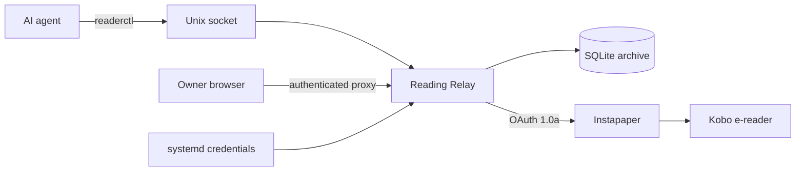

# Agent Reading Relay

Turn agent-generated research, summaries, and reading briefs into calm, long-form
reading on an e-reader.

Agent Reading Relay gives AI agents a narrow, credential-isolated path to save
existing articles or publish generated Markdown to Instapaper. Kobo then receives
the article through its Instapaper integration.

## Why this exists

AI agents are good at collecting information, comparing sources, and turning a
messy stream of updates into a useful narrative. The awkward part is deciding
where that narrative should go.

This project creates a reading inbox for agents. An agent can research a topic,
write a sourced summary, and send it to an e-reader instead of leaving it in a
chat window. That makes workflows such as these practical:

- Summarize recent OpenAI or Anthropic/Claude product changes.
- Turn a research session into a complete evening reading brief.
- Prepare a weekly AI, software, or industry catch-up.
- Explain a technical topic at long-form depth.
- Save an existing web article without rewriting it.

The goal is to catch up deliberately in the evening—not spend the evening
scrolling social feeds looking for the important parts.

## What it includes

- **Reading Relay service:** a small Go service with a SQLite article archive.
- **`readerctl` CLI:** publishes generated Markdown or saves an existing URL.
- **Instapaper Full API client:** OAuth 1.0a signing and xAuth token setup.
- **Safe generated content:** Markdown is rendered to sanitized semantic HTML.
- **Draft-first workflow:** external delivery requires an explicit `--send` flag.
- **Credential isolation:** agents never receive Instapaper credentials.
- **Local agent API:** agents communicate over a mode `0600` Unix socket.
- **Idempotent delivery:** duplicate submissions are deduplicated, and concurrent
  sends have a single delivery winner.
- **Hermes skill:** `skill/send-to-reader/SKILL.md` teaches agents how and when to
  use the relay, including e-reader formatting practices.
- **Hardened systemd unit:** uses systemd credentials and a restricted runtime.

## Architecture



There are two content paths:

1. **Existing URL:** Instapaper receives the original article URL.
2. **Generated Markdown:** the relay renders and sanitizes the Markdown, stores it
   under a stable article URL, and supplies the complete HTML to Instapaper.

Instapaper does not need to crawl the generated article URL because the HTML is
included in the API request. The URL can remain behind an authenticated proxy.

## Deployment scope

The reference deployment currently targets **exe.dev**. Generated article pages
trust the `X-ExeDev-UserID` and `X-ExeDev-Email` headers injected by the exe.dev
authenticated proxy, and the supplied systemd unit uses the default `exedev`
service account.

The core relay, CLI, SQLite store, Markdown renderer, and Instapaper client are
ordinary Linux/Go components. To deploy behind another proxy, adapt the identity
header checks in `internal/relay/http.go` and change the systemd `User=`/`Group=`
settings. Do not expose the article handler directly while trusting headers that
an untrusted client can spoof.

## Security model

The relay is designed as a personal, single-owner service—not a public,
multi-tenant publishing platform.

- Instapaper secrets are loaded only by the systemd service.
- `readerctl` and the agent skill contain no upstream credentials.
- The write API is exposed only through a local Unix socket.
- The public article listener binds to loopback by default.
- Generated article pages require trusted proxy identity headers.
- Agent labels are allowlisted for policy and audit purposes. They are not
  cryptographic identities when all agents run under the same operating-system
  account.
- Draft creation is local. `--send` is required for an Instapaper write.
- Credentials, databases, local environment files, and build artifacts are
  excluded from version control.

If the host is multi-user or local processes are not trusted, add a stronger
proxy-authentication mechanism or isolate the service in its own account or VM.

## Repository layout

```text
cmd/reading-relay/          Service entry point
cmd/readerctl/              Agent-facing CLI
internal/article/           Markdown rendering and sanitization
internal/instapaper/        OAuth 1.0a and Instapaper API client
internal/relay/             Publishing workflow and HTTP handlers
internal/store/             SQLite article and delivery state
internal/relayclient/       Unix-socket client
skill/send-to-reader/       Reusable Hermes agent skill
reading-relay.service       Hardened systemd unit
reading-relay.env.example   Non-secret configuration example
```

## Requirements

- Linux
- Go 1.25 or newer
- An Instapaper account
- An Owner Only Instapaper API application
- systemd for the reference persistent deployment
- A Kobo with Instapaper integration if Kobo delivery is desired

The included systemd unit is tailored to an exe.dev VM, whose default service
user is `exedev`. On another Linux host, change `User=` and `Group=` before
installing the unit.

## Build and test

```bash
git clone https://github.com/andrewedunn/agent-reading-relay.git
cd agent-reading-relay
make test
make build
```

The build creates:

```text
bin/reading-relay
bin/readerctl
```

Additional checks:

```bash
go vet ./...
go test -race ./...
```

## Create an Instapaper application

Sign in to Instapaper's developer site and register an application. New
applications can remain in Owner Only mode for a personal relay.

You will need the application's consumer key and consumer secret. Do not put
these values in this repository or paste them into an agent conversation.

## Configure credentials

Build the binaries, then run the interactive setup command:

```bash
sudo ./bin/readerctl configure-instapaper
```

It prompts for:

1. Instapaper consumer key
2. Instapaper consumer secret
3. Instapaper username or email
4. Instapaper password

Instapaper requires xAuth to obtain the access token. The password is used for
that exchange and is not written to disk. The resulting OAuth credential files
are stored as root-owned mode `0600` files under:

```text
/etc/reading-relay/credentials/
```

The four files are:

```text
instapaper_consumer_key
instapaper_consumer_secret
instapaper_access_token
instapaper_access_token_secret
```

## Configure the service

Install the non-secret configuration file:

```bash
sudo install -d -m 0700 /etc/reading-relay
sudo install -m 0644 reading-relay.env.example \
  /etc/reading-relay/reading-relay.env
sudo editor /etc/reading-relay/reading-relay.env
```

Example:

```dotenv
READING_RELAY_PUBLIC_ADDR=127.0.0.1:8484
READING_RELAY_PUBLIC_BASE_URL=https://your-vm-name.exe.xyz:8484
READING_RELAY_OWNER_EMAIL=owner@example.com
READING_RELAY_ALLOWED_AGENTS=research-agent,family-agent
READING_RELAY_DB_PATH=/var/lib/reading-relay/relay.sqlite3
READING_RELAY_SOCKET_PATH=/run/reading-relay/relay.sock
```

`READING_RELAY_PUBLIC_BASE_URL` must be a stable URL for generated articles.
When using exe.dev, select a proxy port and use that port's HTTPS URL.

## Install and start

Review the unit and environment file first. The supplied hardened unit requires
all four credential files at startup; configure Instapaper before enabling it.
Credential-free draft-only mode is available when running the binary manually,
but not through this unit.

Then install and start it:

```bash
make install
sudo systemctl enable --now reading-relay.service
systemctl status reading-relay.service
```

Useful operations:

```bash
journalctl -u reading-relay.service -f
sudo systemctl restart reading-relay.service
sudo systemctl stop reading-relay.service
```

Health check:

```bash
curl http://127.0.0.1:8484/healthz
```

## Use `readerctl`

### Create a local draft from Markdown

```bash
readerctl publish \
  --title "Weekly AI Brief" \
  --description "A sourced summary of this week's important changes" \
  --file /tmp/weekly-ai-brief.md \
  --agent research-agent
```

### Send generated Markdown to Instapaper

```bash
readerctl publish \
  --title "Weekly AI Brief" \
  --description "A sourced summary of this week's important changes" \
  --file /tmp/weekly-ai-brief.md \
  --agent research-agent \
  --send
```

### Save an existing web article

```bash
readerctl save-url \
  --title "Article title" \
  --url "https://example.com/article" \
  --agent research-agent \
  --send
```

Successful commands return JSON:

```json
{
  "id": "example-article-id",
  "canonical_url": "https://reader.example/articles/example-article-id",
  "status": "delivered",
  "bookmark_id": "example-bookmark-id",
  "created": true
}
```

## Install the Hermes skill

The skill is intentionally uncredentialed. Copy it into each profile that should
be able to use the relay:

```bash
mkdir -p ~/.hermes/profiles/PROFILE/skills/productivity/send-to-reader
cp skill/send-to-reader/SKILL.md \
  ~/.hermes/profiles/PROFILE/skills/productivity/send-to-reader/SKILL.md
```

New agent sessions will discover the skill. The skill instructs agents to:

- distinguish drafts from external sends
- require explicit authorization before using `--send`
- include an agent label and title
- preserve source citations
- avoid secrets and sensitive material
- format generated Markdown for a narrow e-reader screen
- report the resulting article and delivery status

## Generated Markdown best practices

The relay works best with simple, semantic Markdown. Different automations can
choose different structures; no fixed article template is required.

- Pass the title through `--title` instead of repeating it as a top-level H1.
- Prefer short paragraphs and descriptive H2/H3 headings.
- Use lists when they genuinely improve scanning.
- Convert tables into bullets, labeled sections, or prose.
- Keep code blocks short and narrow.
- Avoid raw HTML and layout-oriented markup.
- Use images sparingly, with alt text and absolute URLs.
- Prefer descriptive inline links or a simple Sources section.
- Do not rely on Markdown footnotes; the current renderer does not create true
  formatted footnotes.

## Operational behavior

### Drafts and delivery

A publish request is stored before external delivery. Drafts remain local until a
caller explicitly requests a send. Delivery states are:

- `draft`
- `sending`
- `delivered`
- `failed`

If the service restarts during a send, the interrupted article is marked failed
and can be retried. Concurrent requests for the same article cannot both win the
external-delivery claim.

### Deduplication

Generated documents use a content-derived identity. Existing URLs are keyed by
their URL. Pending URL metadata can be corrected before delivery. Repeating an
already-delivered request returns the existing delivery state instead of sending
a second copy.

### Revocation

To revoke access:

```bash
sudo systemctl stop reading-relay.service
sudo rm /etc/reading-relay/credentials/instapaper_*
```

Then revoke or rotate the corresponding Instapaper application credentials.
The hardened systemd unit will not start without the complete credential set.

## Troubleshooting

### `call reading relay: ... no such file or directory`

The service is not running, or `READING_RELAY_SOCKET_PATH` differs between the
service and `readerctl`.

```bash
systemctl status reading-relay.service
stat /run/reading-relay/relay.sock
```

### `Instapaper delivery is not configured`

The four credential files are missing or the service was started outside the
systemd unit without a credential directory.

### Article is in Instapaper but not on Kobo

Confirm that Kobo's Instapaper integration is signed in, then trigger a Kobo sync.
The relay sends to Instapaper; Kobo delivery is downstream of that account sync.

### Generated page returns `authentication required`

The article page expects the configured trusted proxy to inject its identity
headers. Direct requests to the loopback listener do not carry those headers.

## Development

```bash
go test ./...
go test -race ./...
go vet ./...
```

Behavior changes should include tests. In particular, preserve:

- OAuth signature compatibility
- draft-by-default semantics
- explicit external-send authorization
- Unix-socket-only write access
- sanitization of generated HTML
- atomic delivery claims

## Project status

This is a small personal-service project rather than a hosted product. Review the
security assumptions and deployment unit before using it on a different host.

## License

MIT. See `LICENSE`.
